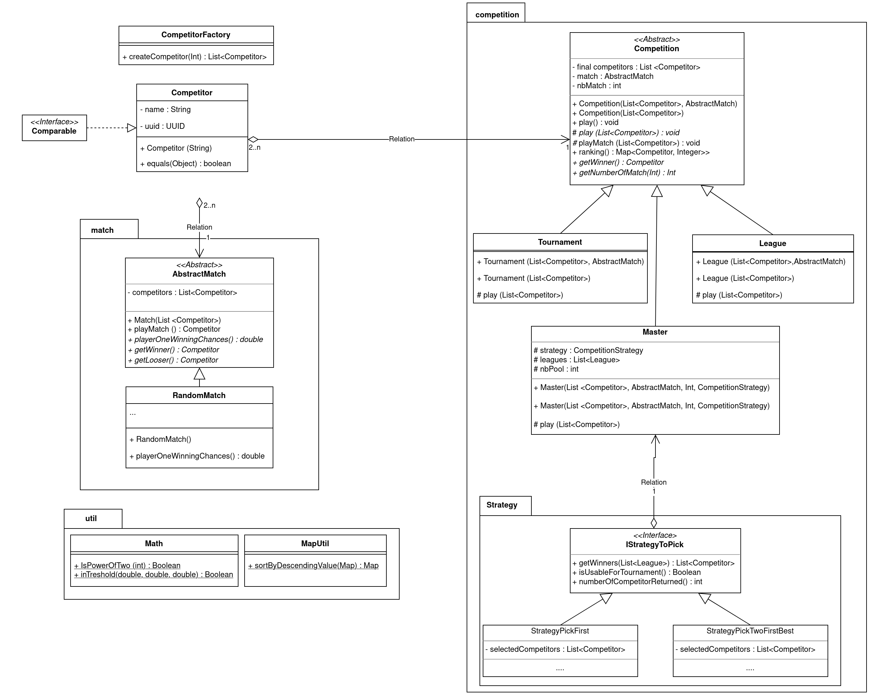

# L3S5G7-COO-ALMEIDA-BOUSSERT

ALMEIDA Néo - L3 INFORMATIQUE - GROUPE 7
BOUSSERT Ambre - L3 INFORMATIQUE - GROUPE 7

## 1. Quick introduction of the project

Sport competitions ! There are two types of competition : 
- League which is a competition where competitors fight twice against everybody. The competitor with the most victory, wins. 
- Tournament which is a competition where only winners can continue and only one will stay at the end. 

## 2. *HowTo* 

### 2.1 Get the project
	
```
git clone https://gitlab-etu.fil.univ-lille.fr/neo.almeida.etu/l3s5g7-coo-almeida-boussert.git
# OU
git clone git@gitlab-etu.fil.univ-lille.fr:neo.almeida.etu/l3s5g7-coo-almeida-boussert.git
```

### 2.2 Generate project's documentation 

To generate project's documentation, you just have to execute theses commands :

```
# LINUX 
javadoc -sourcepath src -subpackages fr.main.java -d docs -cp ./dependencies/json_simple.jar

# WINDOWS
javadoc -sourcepath src -subpackages fr.main.java -d docs -cp .\dependencies\json_simple.jar
```

### 2.3.1 Generate sources

Root folder
```
# LINUX
javac -cp ./dependencies/json_simple.jar -sourcepath src ./src/fr/main/java/*.java -d ./bin

# WINDOWS
javac -cp .\dependencies\json_simple.jar -sourcepath src .\src\fr\main\java\*.java -d .\bin

```

### 2.3.2 Execute sources

Root folder
```
# LINUX
java -cp "dependencies/json_simple.jar:bin:." fr.main.java.Main

# WINDOWS
java -cp "dependencies\json_simple.jar;bin;." fr.main.java.Main
```

### 2.4.1 Generate tests
Root folder
```
# LINUX
javac -cp "./dependencies/junit-platform-console-standalone-1.9.0.jar:./dependencies/json_simple.jar" -sourcepath src ./src/fr/test/java/*/*.java -d ./bin

# WINDOWS
javac -cp ".\dependencies\junit-platform-console-standalone-1.9.0.jar;.\dependencies\json_simple.jar" -sourcepath src .\src\fr\test\java\*.java -d .\bin

```

### 2.4.2 Execute tests

```
# LINUX
java -jar ./dependencies/junit-platform-console-standalone-1.9.0.jar -class-path "bin:./dependencies/json_simple.jar" --scan-class-path

# WINDOWS
java -jar .\dependencies\junit-platform-console-standalone-1.9.0.jar --class-path "bin;.\dependencies\json_simple.jar" --scan-class-path

```

### 2.5.1 Generate JAR 

To generate project's JAR, you just have to execute theses commands :
```
jar cfm Program.jar MANIFEST.txt .
```

### 2.5.2 Execute JAR

To execute the JAR, you just have to execute theses commands :  
```
# LINUX
java -jar ./Program.jar

# WINDOWS
java -jar .\Program.jar
```

## 3. Interesting element of the project :

- *Design elements who can be interesting or important to show*
- *Presentations of the design patterns implemented*
- *All points that allow us to enhance our project* 

## 4 UML


